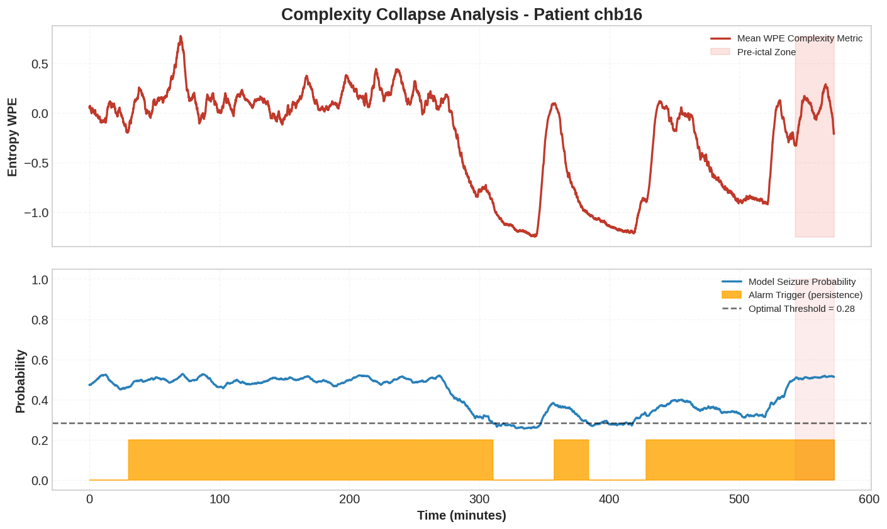
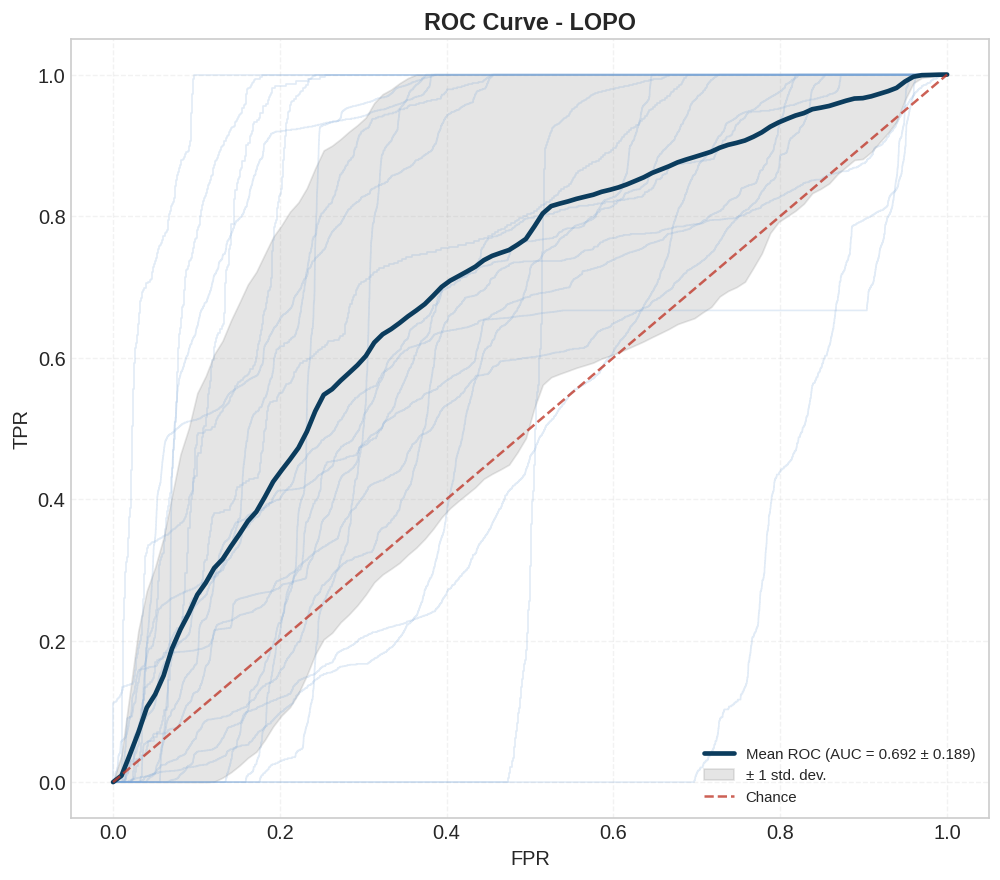
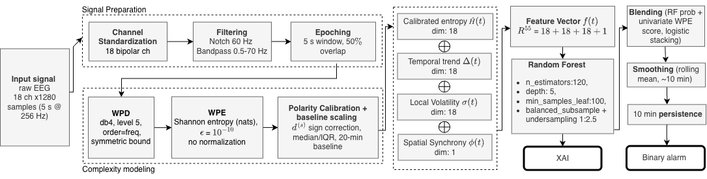

# Wavelet Packet Entropy for Epileptic Seizure Prediction

**An explainable pipeline that predicts epileptic seizures from scalp EEG before they happen.** It tracks the *complexity* of brain activity with Wavelet Packet Entropy (WPE), detects the change in complexity that precedes a seizure, and raises an alarm with a Random Forest classifier. Evaluated on the CHB-MIT database with Leave-One-Patient-Out cross-validation.

<p align="center">
  
</p>
<p align="center"><em>Patient chb16, about 10 hours of EEG. Top: mean WPE across the 18 channels. Bottom: predicted seizure probability and the alarm after the persistence rule. The red band is the 30-minute pre-ictal window.</em></p>

> Authors: **Andrea Ricci** and Gaia Scarponi · Sapienza University of Rome · [Full paper](docs/report.pdf)

---

## Highlights

- **Complexity, not energy.** Most methods look for high-energy spikes. This pipeline looks for the opposite signal: a change in the *order* of brain activity in the pre-ictal phase, measured as the Shannon entropy of the wavelet packet energy distribution.
- **Patient-specific polarity calibration.** Entropy rises before seizures in some patients and falls in others. Each patient's direction is estimated and corrected, so a single classifier can be trained across patients. This step alone raises the mean AUC from 0.55 to 0.68.
- **Clinically oriented evaluation.** Beyond AUC, the pipeline reports event-level metrics: seizure sensitivity, warning time, false alarms per hour, and time spent in warning.
- **Rigorous protocol.** Leave-One-Patient-Out cross-validation, an ablation study, a nested threshold selection on training patients only, and paired Wilcoxon tests.
- **Explainable.** A Random Forest with feature importance analysis by feature family and by EEG channel.

## Results

Final configuration, 20 evaluable patients, Leave-One-Patient-Out:

| AUC-ROC | Seizures predicted | Median warning time | False alarms |
|:---:|:---:|:---:|:---:|
| **0.69 ± 0.19** | **42 / 44** (95.5%) | **27 min** | 0.25 / hour |

<p align="center">
  
</p>

### Ablation study

| Configuration | AUC (%) | Specificity (%) | Seizure sensitivity (%) | False alarms / h |
|---|:---:|:---:|:---:|:---:|
| A. Raw WPE | 55.2 | 35.9 | 70.4 | 0.09 |
| B. + Polarity calibration | 67.7 | 25.9 | 81.8 | 0.35 |
| C. + Full feature space | 69.2 | 19.8 | 100.0 | 0.54 |
| **D. + 10-min persistence rule** | **69.2** | **26.8** | **95.5** | **0.25** |

The persistence rule leaves the AUC unchanged but halves the false alarm rate. In a paired Wilcoxon test the gain from A to D (+0.14 AUC) comes closest to significance (p = 0.064, n = 20).

## How it works

<p align="center">
  
</p>

1. **Signal preparation.** 18 standard bipolar channels, 60 Hz notch filter, 0.5–70 Hz band-pass filter, 5-second epochs with 50% overlap.
2. **Wavelet Packet Entropy.** Each epoch and channel is decomposed with a `db4` wavelet packet at level 5. WPE is the Shannon entropy of the energy distribution across the 32 terminal nodes.
3. **Labeling.** Pre-ictal = the 30 minutes before a 5-minute seizure prediction horizon. The seizure itself and the 4 hours after it are discarded.
4. **Normalization and calibration.** Robust scaling (median and IQR) on the first 20 minutes of each patient's inter-ictal recording, then the polarity correction.
5. **Features (55 per epoch).** Calibrated WPE (18), temporal trend as fast minus slow moving average (18), local volatility (18) and spatial synchrony across channels (1).
6. **Classification.** Random Forest with cost-sensitive class weights and 1:2.5 undersampling, blended with a univariate logistic score. Probabilities are smoothed over about 10 minutes, and an alarm fires only if the prediction persists for 10 minutes.

## Repository structure

```
notebooks/
├── 01_Data_Engineering.ipynb     filtering, epoching, WPE extraction from the raw EDF files (Kaggle)
├── 02_Data_Manipulation.ipynb    labeling, robust standardization, polarity estimation
├── 03_LOPO.ipynb                 LOPO cross-validation, ablation study, plots, feature importance, heterogeneity analysis
├── 04_PatientsDescriptor.ipynb   per-patient dataset statistics and inclusion criteria
└── 05_Test.ipynb                 Wilcoxon signed-rank tests between configurations
docs/
├── report.pdf                    full paper
└── figures/
requirements.txt
```

## Getting started

### 1. Get the data

The [CHB-MIT Scalp EEG Database](https://physionet.org/content/chbmit/1.0.0/) is publicly available on PhysioNet. It is not included in this repository because of its size (about 40 GB).

`01_Data_Engineering.ipynb` was run on Kaggle, where the notebook downloads a mirror of the dataset with `kagglehub`. The other notebooks were run on Google Colab and read the intermediate features from Google Drive. You also need the `chbXX-summary.txt` files from the dataset, which contain the seizure annotations.

### 2. Install the dependencies

```bash
pip install -r requirements.txt
```

### 3. Run the notebooks in order

Before running each notebook, update the paths in its *Setup* cell to point to your own data folder.

## Limitations

- **The polarity calibration is not fully causal.** The entropy direction of each patient is estimated from that patient's labeled recordings, so the system needs a short per-patient calibration step and is not a zero-shot predictor. Using only the directions of the training patients drops the mean AUC from 0.69 to 0.57.
- **Low epoch-level specificity.** The classifier is tuned to favor sensitivity. The persistence rule turns this into few distinct false alarms (0.25 per hour), but the system still spends a large share of inter-ictal time in warning (73% on average).
- **High variability across patients.** Per-patient AUC ranges from 0.17 to 0.96, and 4 of 24 patients could not be evaluated.
- **Retrospective evaluation.** The threshold and the persistence rule are evaluated offline, so the results are an upper bound for a real-time deployment.
- **Pediatric dataset.** CHB-MIT contains only pediatric patients from a single center.

## Authors

**Andrea Ricci** and Gaia Scarponi contributed equally to the code and to the paper.
